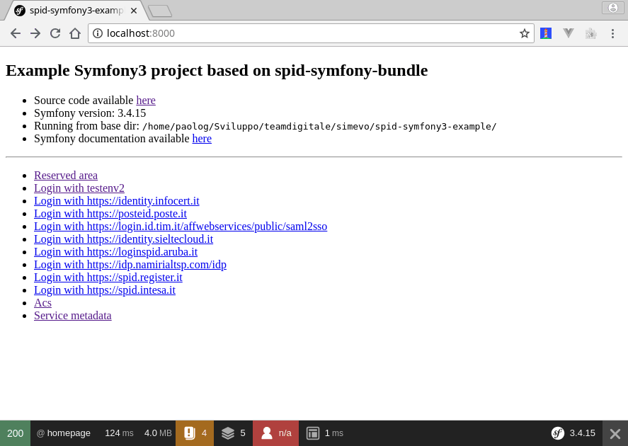

# spid-symfony3-example

Example Symfony3 project based on [spid-symfony-bundle](https://github.com/italia/spid-symfony-bundle) to demonstrate how to integrate SPID login.

[SPID](https://www.spid.gov.it/) is the Italian digital identity system, which enables citizens to access all public services with a single set of credentials.

The project [was initially created](https://symfony.com/doc/3.4/setup.html) with:

```sh
php symfony.phar new spid-symfony3-example 3.4
```

## Getting Started

Tested on: amd64 Debian 9.5 (stretch, current stable) with PHP 7.0.

### Prerequisites

```
sudo apt install composer make openssl php-curl php-zip php-xml phpunit php-cli
```

### Configuring and Installing

Before using this package, you must:

1. Configure your application in the `app/config/parameters.yml` file (you can use `app/config/parameters.yml.dist` as a template)

2. Configure SPID in the `spid_symfony` key in the `app/config/config.yml` file, you should at least adapt the base url (used in the `sp_entityid`, `sp_singlelogoutservice` and `sp_assertionconsumerservice` keys) to your needs

3. Install PHP dependencies with composer

4. Download and verify the Identity Provider (IdP) metadata files; it is advised to place them in a separate [idp_metadata/](example/idp_metadata/) directory. A convenience tool is provided for this purpose: [bin/download_idp_metadata.php](bin/download_idp_metadata.php).

5. Generate key and certificate for the Service Provider (SP).

The last three steps can be performed in an unattended fashion with:
```sh
composer install --no-dev
mkdir -p example/idp_metadata
make -f ./vendor/italia/spid-php-lib/Makefile
./vendor/italia/spid-php-lib/bin/download_idp_metadata.php ./example/idp_metadata
```

**NOTE**: during testing, it is highly adviced to use the test Identity Provider [spid-testenv2](https://github.com/italia/spid-testenv2).

### Demo

  1. Execute the `php bin/console server:start` command

  2. Visit https://localhost:8000/metadata to get the SP (Service Provider) metadata, then copy these over to the IdP and register the SP

  3. Browse to the http://localhost:8000/reserved, you should see: `Authentication Required`

  4. Visit https://localhost:8000/ and click `login`

  5. Browse to the http://localhost:8000/reserved, you should see: `Really reserved stuff here !`

This screencast shows what you should see if all goes well:



## Troubleshooting

It is advised to install a browser plugin to trace SAML messages:

- Firefox:

  - [SAML-tracer by Olav Morken, Jaime Perez](https://addons.mozilla.org/en-US/firefox/addon/saml-tracer/)
  - [SAML Message Decoder by Magnus Suther](https://addons.mozilla.org/en-US/firefox/addon/saml-message-decoder-extension/)

- Chrome/Chromium:

  - [SAML Message Decoder by Magnus Suther](https://chrome.google.com/webstore/detail/saml-message-decoder/mpabchoaimgbdbbjjieoaeiibojelbhm)
  - [SAML Chrome Panel by MLai](https://chrome.google.com/webstore/detail/saml-chrome-panel/paijfdbeoenhembfhkhllainmocckace)
  - [SAML DevTools extension by stefan.rasmusson.as](https://chrome.google.com/webstore/detail/saml-devtools-extension/jndllhgbinhiiddokbeoeepbppdnhhio)

In addition, you can use the [SAML Developer Tools](https://www.samltool.com/online_tools.php) provided by onelogin to understand what is going on

## License

Copyright (c) 2018, simevo s.r.l.

License: BSD 3-Clause, see [LICENSE](LICENSE) file.
